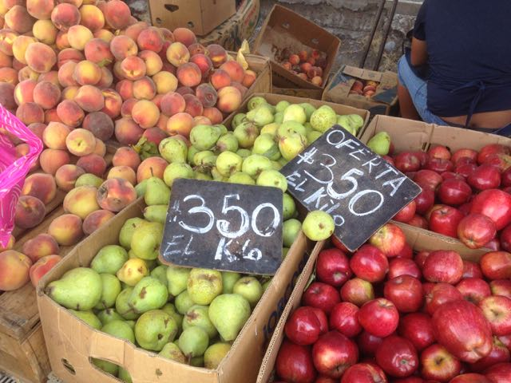
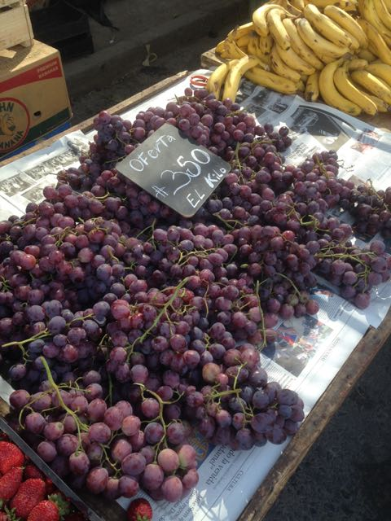
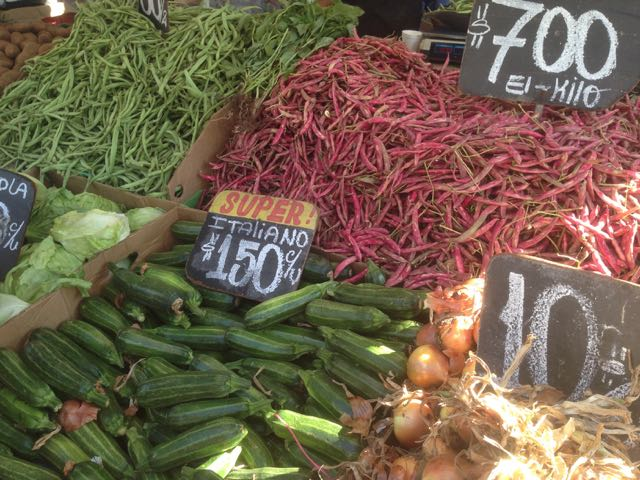
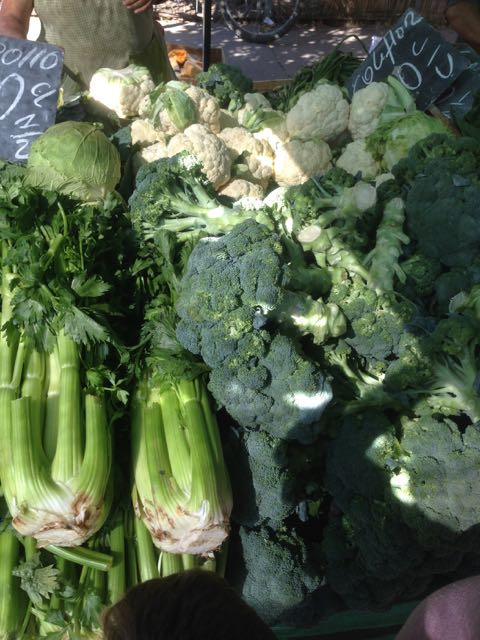
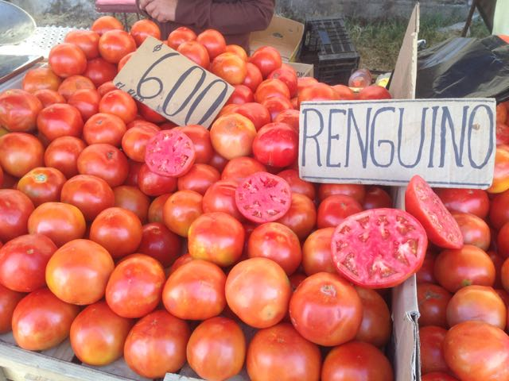
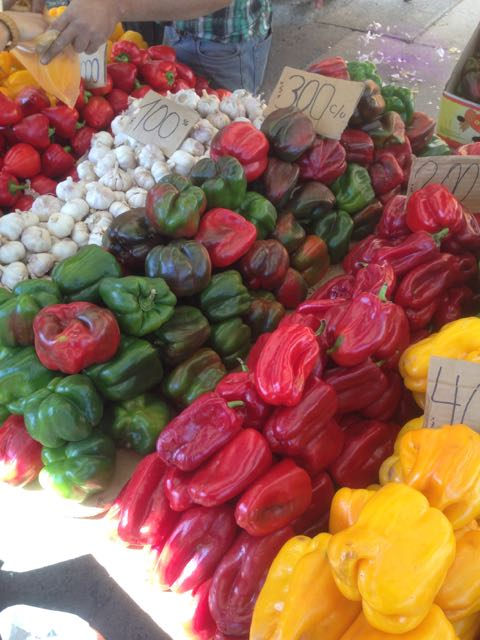
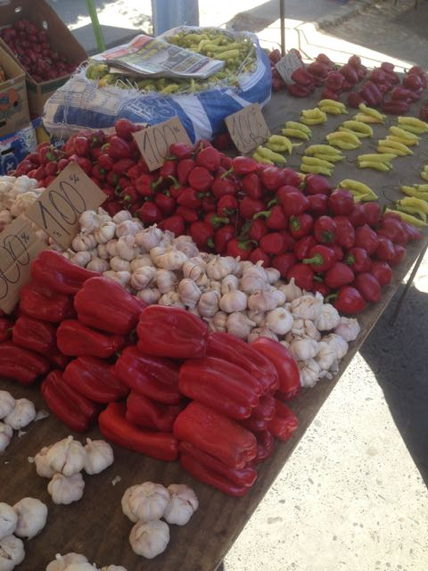

This was my trip to the market this morning. Every Friday we have a local market in the neighborhood.  These happen everyday in multiple places every week.  This was about 3 blocks from our place.  Chilean peso has recently weakened in value!!!  Good for me, it is now 640~ pesos to $1 USD, about 25 pesos more than in Dec. To convert price CLP/KILO to USD/LB divide CLP/1405.  All of this is local, but not organic.  Its only what is in season, so every couple of weeks it changes pretty drastically.    

This is our bounty for the week.  A nice score at $24 USD!!!

Apples, peaches, pears, apricots all at the same price, 25c/lb!!!

We bought some strawberries to make jam!  These boxes were $7.75 a box, we got the same size box riper berries for $4.75 instead!

These grapes were the size of gumballs!

Beans, Zucchinis and what not!

These celery were monsters, at least 18in long!

One of the house favorites and dirt cheap!  The large tomatoe that is cut open is 5in wide, they are .45c/lb!!!

Peppers, garlic and chilies

